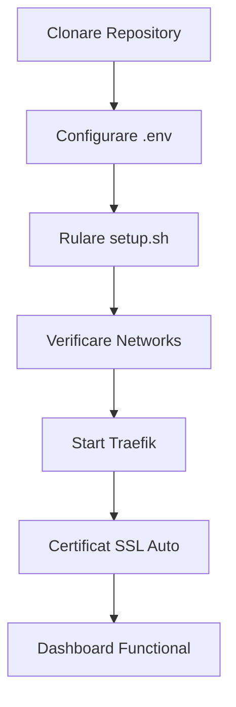

# 📖 GHID COMPLET DE UTILIZARE - Traefik Reverse Proxy

## 📌 Ce este acest repository?

Acesta este un **sistem complet de reverse proxy** bazat pe **Traefik v3.5** care oferă:
- ✅ **HTTPS automat** cu certificate Let's Encrypt gratuite
- ✅ **Routing inteligent** pentru mai multe aplicații pe același server
- ✅ **Securitate avansată** cu rate limiting, security headers și network isolation
- ✅ **Setup automat** în mai puțin de 5 minute
- ✅ **Zero maintenance** - certificatele se reînnoiesc automat

## 🎯 Pentru cine este util?

- **Administratori de sistem** care vor să expună mai multe aplicații web pe același server
- **Dezvoltatori** care vor HTTPS automat pentru aplicațiile lor
- **Echipe DevOps** care caută o soluție de reverse proxy production-ready
- **Oricine** vrea să ruleze WordPress, Nextcloud, Portainer cu HTTPS valid

## 🚀 QUICK START - Pornire în 5 minute

### 1️⃣ **Clonează repository-ul**
```bash
git clone https://github.com/reluparfene/traefik-deploy.git traefik
cd traefik
```

### 2️⃣ **Configurează variabilele**
```bash
cp .env.example .env
nano .env
```

**Modifică OBLIGATORIU:**
```env
DOMAIN=domeniul-tau.ro
ACME_EMAIL=email@domeniul-tau.ro
CLOUDNS_SUB_AUTH_ID=id-ul-tau
CLOUDNS_AUTH_PASSWORD=parola-ta

# DNS Resolvers - folosește serverele DNS specifice domeniului tău de la ClouDNS
# Exemplu pentru domeniu .net: ns31-34.cloudns.net
# Exemplu pentru domeniu .com: ns11-14.cloudns.net
DNS_RESOLVERS=pns31.cloudns.net:53,pns32.cloudns.net:53,pns33.cloudns.net:53,pns34.cloudns.net:53
```

### 3️⃣ **Generează parola pentru dashboard**
```bash
# Generează o parolă securizată
htpasswd -nb admin parola-ta | sed 's/\$/DOLLAR/g'

# Copiază rezultatul în .env la TRAEFIK_BASIC_AUTH_PASSWORD
```

### 4️⃣ **Rulează setup-ul automat**
```bash
./scripts/setup.sh
```

### 5️⃣ **Verifică funcționarea**
```bash
# Verifică containerul
docker ps

# Vezi logs
docker logs -f traefik-proxy

# Accesează dashboard-ul
# https://traefik.domeniul-tau.ro
```

## 📋 WORKFLOW COMPLET DE UTILIZARE

### **A. Prima instalare (Fresh Install)**



**Pași detaliați:**

1. **Pregătire server**
   - Server cu Docker instalat
   - Porturi 80 și 443 libere
   - Domeniu cu DNS configurat

2. **Configurare DNS (la provider)**
   - Adaugă record A: `@` → IP server
   - Adaugă record A: `*` → IP server (pentru subdomenii)
   - Adaugă record A: `traefik` → IP server

3. **Instalare Traefik**
   ```bash
   cd /opt
   git clone https://github.com/reluparfene/traefik-template.git traefik
   cd traefik
   cp .env.example .env
   ```

4. **Editare configurație**
   ```bash
   nano .env
   # Modifică: DOMAIN, ACME_EMAIL, CLOUDNS credentials, DNS_RESOLVERS, passwords
   # IMPORTANT: DNS_RESOLVERS trebuie să fie serverele specifice domeniului tău
   # Verifică în panoul ClouDNS care sunt serverele NS pentru domeniul tău
   ```

5. **Rulare setup**
   ```bash
   ./scripts/setup.sh
   # Răspunde YES la toate întrebările
   ```

6. **Verificare**
   - Dashboard: `https://traefik.domeniul-tau.ro`
   - User: `admin`
   - Parolă: cea setată în .env

### **B. Adăugare aplicație nouă**

#### **Metoda 1: Docker Compose (Recomandat)**

1. **Creează folder pentru aplicația ta**
   ```bash
   mkdir -p /opt/aplicatia-mea
   cd /opt/aplicatia-mea
   ```

2. **Creează docker-compose.yml**
   ```yaml
   version: '3.8'

   services:
     aplicatie:
       image: nginx:latest
       container_name: aplicatia-mea
       networks:
         - traefik-frontend
       labels:
         # Activare Traefik
         - "traefik.enable=true"
         - "traefik.docker.network=traefik-frontend"

         # Routing HTTP → HTTPS
         - "traefik.http.routers.app.entrypoints=web"
         - "traefik.http.routers.app.rule=Host(`app.domeniul-tau.ro`)"
         - "traefik.http.routers.app.middlewares=https-redirect@file"

         # Routing HTTPS
         - "traefik.http.routers.app-secure.entrypoints=websecure"
         - "traefik.http.routers.app-secure.rule=Host(`app.domeniul-tau.ro`)"
         - "traefik.http.routers.app-secure.tls=true"
         - "traefik.http.routers.app-secure.tls.certresolver=le-dns"
         - "traefik.http.routers.app-secure.middlewares=security-chain@file"

         # Port intern al aplicației
         - "traefik.http.services.app.loadbalancer.server.port=80"

   networks:
     traefik-frontend:
       external: true
   ```

3. **Pornește aplicația**
   ```bash
   docker-compose up -d
   ```

4. **Verifică certificatul**
   ```bash
   # Durează 30-60 secunde pentru certificat
   docker logs traefik-proxy | grep app.domeniul-tau.ro
   ```

#### **Metoda 2: Container simplu**

```bash
docker run -d \
  --name aplicatia-mea \
  --network traefik-frontend \
  --label "traefik.enable=true" \
  --label "traefik.docker.network=traefik-frontend" \
  --label "traefik.http.routers.app.rule=Host(\`app.domeniul-tau.ro\`)" \
  --label "traefik.http.routers.app-secure.tls.certresolver=le-dns" \
  nginx:latest
```

### **C. Arhitectura rețelelor**

Repository-ul creează automat 4 rețele Docker izolate:

```
┌─────────────────────────────────────────────┐
│            INTERNET (80/443)                 │
└────────────────┬────────────────────────────┘
                 │
        ┌────────▼────────┐
        │  traefik-public │ 10.240.0.0/24
        │   (DMZ/Edge)    │
        └────────┬────────┘
                 │
        ┌────────▼────────┐
        │traefik-frontend │ 10.241.0.0/24
        │  (Applications) │
        └────────┬────────┘
                 │
        ┌────────▼────────┐
        │ traefik-backend │ 10.242.0.0/24
        │   (Databases)   │ (Internal Only)
        └─────────────────┘

        ┌─────────────────┐
        │traefik-management│ 10.243.0.0/24
        │  (Monitoring)    │ (Internal Only)
        └─────────────────┘
```

**Cum să folosești rețelele:**

- **Frontend App**: `traefik-frontend`
- **Database**: `traefik-backend` (nu expusă extern)
- **Monitoring**: `traefik-management` (pentru Prometheus, Grafana)
- **Public**: `traefik-public` (doar pentru Traefik)

### **D. Exemple practice**

#### **1. WordPress cu MariaDB**
```bash
cd examples/wordpress
docker-compose up -d
# Accesează: https://blog.domeniul-tau.ro
```

#### **2. Nextcloud cu PostgreSQL**
```bash
cd examples/nextcloud
docker-compose up -d
# Accesează: https://cloud.domeniul-tau.ro
```

#### **3. Portainer pentru management Docker**
```bash
cd examples/portainer
docker-compose up -d
# Accesează: https://portainer.domeniul-tau.ro
```

## 🔧 OPERAȚIUNI COMUNE

### **Verificare status**
```bash
# Vezi toate containerele
docker ps

# Vezi logs Traefik
docker logs -f traefik-proxy

# Vezi certificate
docker exec traefik-proxy cat /acme.json | jq '.Certificates[].domain'

# Vezi rețele
docker network ls | grep traefik
```

### **Restart servicii**
```bash
# Restart Traefik
docker-compose restart traefik

# Restart complet
docker-compose down && docker-compose up -d
```

### **Backup certificate**
```bash
# Salvare certificat
cp data/acme.json ~/backup-acme-$(date +%Y%m%d).json

# Restaurare certificat
cp ~/backup-acme.json data/acme.json
chmod 600 data/acme.json
```

### **Update Traefik**
```bash
# Pull ultima versiune
docker-compose pull

# Restart cu noua versiune
docker-compose up -d
```

## 🚨 TROUBLESHOOTING

### **Problema 1: Certificate nu se generează**

**Simptome**: Site-ul arată "Certificate Invalid"

**Soluții**:
1. Verifică DNS-ul:
   ```bash
   nslookup subdominiu.domeniul-tau.ro
   ```

2. Verifică logs:
   ```bash
   docker logs traefik-proxy | grep -i error
   ```

3. Verifică credențiale ClouDNS în .env

### **Problema 2: 404 Page Not Found**

**Cauze posibile**:
- Aplicația nu e pe rețeaua corectă
- Label-uri greșite în docker-compose
- Traefik nu vede containerul

**Verificare**:
```bash
# Vezi ce containere vede Traefik
docker exec traefik-proxy wget -qO- http://localhost:8080/api/http/routers | jq
```

### **Problema 3: Connection Refused**

**Verificări**:
- Port corect în labels (loadbalancer.server.port)
- Container pornit: `docker ps`
- Rețea corectă: `docker inspect nume-container | grep NetworkMode`

### **Problema 4: Rate Limit Exceeded**

**Simptom**: "429 Too Many Requests"

**Soluție**: Modifică în `config/dynamic/middlewares.yml`:
```yaml
rate-limit:
  rateLimit:
    average: 200  # Crește limita
    burst: 100
```

## 📊 MONITORIZARE ȘI LOGS

### **Logs în timp real**
```bash
# Toate logurile
docker-compose logs -f

# Doar Traefik
docker logs -f traefik-proxy

# Ultimele 100 linii
docker logs --tail 100 traefik-proxy
```

### **Metrici și monitoring**
Dashboard-ul Traefik oferă:
- Număr total cereri
- Cereri per serviciu
- Erori HTTP (4xx, 5xx)
- Certificate active
- Health status servicii

Acces: `https://traefik.domeniul-tau.ro/dashboard/`

### **Rotație automată logs**
Configurată automat:
- Max 10MB per fișier log
- Păstrează ultimele 3 fișiere
- Total maxim: 30MB per container

## 🔐 SECURITATE

### **Features active by default:**

1. **HTTPS Obligatoriu**
   - Redirect automat HTTP → HTTPS
   - Certificate Let's Encrypt valide

2. **Security Headers**
   - HSTS (Strict Transport Security)
   - X-Frame-Options: DENY
   - X-Content-Type-Options: nosniff
   - CSP (Content Security Policy)

3. **Rate Limiting**
   - 100 requests/average
   - 50 requests/burst

4. **Network Isolation**
   - Databases izolate în backend network
   - Management tools pe rețea separată

5. **Basic Auth pentru Dashboard**
   - User/parolă obligatorii
   - Parolă criptată bcrypt

### **Best Practices:**
- ✅ Nu expune NICIODATA porturile bazelor de date
- ✅ Folosește întotdeauna rețele Docker separate
- ✅ Actualizează regulat imaginile Docker
- ✅ Fă backup la acme.json
- ✅ Monitorizează logs pentru atacuri

## 📝 CHECKLIST DEPLOYMENT PRODUCȚIE

- [ ] Server cu minim 2GB RAM, 2 CPU
- [ ] Docker și Docker Compose instalate
- [ ] Domeniu înregistrat cu DNS configurat
- [ ] Cont ClouDNS pentru DNS challenge
- [ ] Ports 80 și 443 deschise în firewall
- [ ] Backup strategie pentru acme.json
- [ ] Monitoring configurare (optional)
- [ ] Rate limiting ajustat pentru trafic așteptat

## 🆘 SUPORT ȘI RESURSE

- **Documentație Traefik**: https://doc.traefik.io/
- **Repository GitHub**: https://github.com/reluparfene/traefik-deploy
- **Issues/Bugs**: Deschide un issue pe GitHub
- **Let's Encrypt Status**: https://letsencrypt.status.io/

## 📌 TIPS & TRICKS

1. **Folosește subdomain wildcard**
   - DNS: `*.domeniul-tau.ro → IP`
   - Nu mai trebuie să adaugi DNS pentru fiecare aplicație

2. **Testează cu staging Let's Encrypt**
   - Pentru development, modifică în traefik.yml:
   ```yaml
   caServer: https://acme-staging-v02.api.letsencrypt.org/directory
   ```

3. **Debug mode pentru probleme**
   ```yaml
   log:
     level: DEBUG
   ```

4. **Middleware chains personalizate**
   - Creează în `data/configurations/custom.yml`
   - Referință cu `@file` în labels

5. **Health checks**
   ```yaml
   healthcheck:
     test: ["CMD", "traefik", "healthcheck", "--ping"]
     interval: 30s
   ```

---

**Versiune**: 1.0.0
**Ultima actualizare**: 2024
**Menținut de**: Repository Community