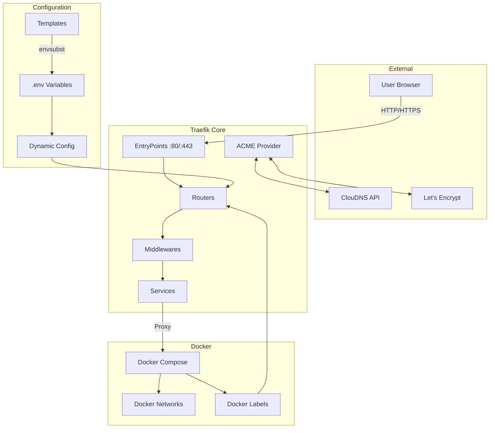
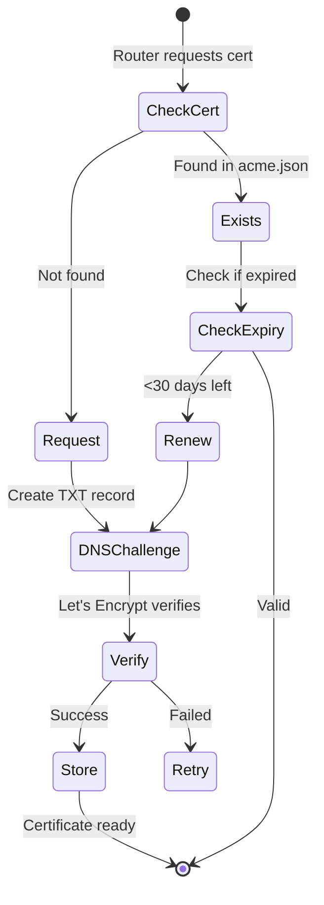

# 🔧 DOCUMENTAȚIE TEHNICĂ DETALIATĂ - Traefik Template Repository

## 📚 CUPRINS

1. [Arhitectura Generală](#arhitectura-generală)
2. [Structura Repository](#structura-repository)
3. [Componente Core](#componente-core)
4. [Flow-ul de Setup](#flow-ul-de-setup)
5. [Sistem de Templates](#sistem-de-templates)
6. [Network Architecture](#network-architecture)
7. [Scripturi de Automatizare](#scripturi-de-automatizare)
8. [Configurare Traefik](#configurare-traefik)
9. [Middleware Chain](#middleware-chain)
10. [Certificate Management](#certificate-management)
11. [Docker Integration](#docker-integration)
12. [Security Implementation](#security-implementation)
13. [Extensibilitate și Customizare](#extensibilitate-și-customizare)
14. [Debugging și Troubleshooting](#debugging-și-troubleshooting)
15. [Development Workflow](#development-workflow)

## 🏗️ ARHITECTURA GENERALĂ

### **Design Philosophy**

Repository-ul este construit pe principiile:
- **Infrastructure as Code (IaC)** - Toată configurația este versionată
- **Template-based Configuration** - Folosește `envsubst` pentru variabile
- **Zero-touch Deployment** - Setup complet automatizat
- **Security by Default** - Toate feature-urile de securitate active
- **Network Segmentation** - Izolare completă între layers

### **Technology Stack**

```
┌─────────────────────────────────────┐
│         Application Layer           │
│  (WordPress, Nextcloud, Custom Apps)│
└──────────────┬──────────────────────┘
               │
┌──────────────▼──────────────────────┐
│         Traefik v3.5                │
│  (Reverse Proxy & Load Balancer)    │
└──────────────┬──────────────────────┘
               │
┌──────────────▼──────────────────────┐
│         Docker Engine               │
│    (Container Runtime)              │
└──────────────┬──────────────────────┘
               │
┌──────────────▼──────────────────────┐
│      Linux Host (Debian/Ubuntu)     │
└─────────────────────────────────────┘
```

### **Component Interaction Diagram**



## 📁 STRUCTURA REPOSITORY

### **Directory Tree Complet**

```
traefik/
├── config/                          # Template-uri de configurare
│   ├── traefik.yml.template        # Config static Traefik (procesată cu envsubst)
│   └── dynamic/                    # Configurări dinamice
│       └── middlewares.yml         # Definirea middleware chains
│
├── data/                           # Date runtime (generat de setup.sh)
│   ├── traefik.yml                # Config procesată din template
│   ├── acme.json                  # Certificate Let's Encrypt (chmod 600)
│   └── configurations/            # Config dinamice procesate
│       └── middlewares.yml        # Middlewares cu variabile rezolvate
│
├── scripts/                       # Automatizare și setup
│   ├── setup.sh                  # Script principal de instalare
│   ├── preflight-check.sh       # Verificări sistem înainte de setup
│   ├── validate-config.sh       # Validare configurație
│   ├── check-networks.sh        # Verificare disponibilitate subnets
│   ├── setup-networks-safe.sh   # Creare safe networks cu fallback
│   ├── save-config.sh           # Backup configurație
│   └── update-from-template.sh  # Update din upstream template
│
├── examples/                     # Exemple de servicii
│   ├── wordpress/               # WordPress + MariaDB
│   ├── nextcloud/              # Nextcloud + PostgreSQL + Redis
│   └── portainer/              # Portainer + Agent
│
├── docs/                        # Documentație adițională
│   ├── NETWORK_SEGMENTATION.md # Detalii arhitectură rețele
│   ├── TEMPLATE_USAGE.md      # Ghid utilizare ca template
│   └── ENV_MANAGEMENT_WORKFLOW.md # Workflow management .env
│
├── docker-compose.yml          # Configurația principală Traefik
├── .env.example               # Template variabile environment
├── .env                      # Symlink către /opt/traefik-configs/.env
├── .gitignore               # Exclude data/, .env, logs
├── CLAUDE.md               # Instrucțiuni pentru Claude AI
└── README.md              # Documentație principală
```

### **Fișiere Generate Runtime**

```
data/
├── traefik.yml            # Generated from config/traefik.yml.template
├── acme.json             # Let's Encrypt certificates storage
├── configurations/
│   └── middlewares.yml  # Generated from config/dynamic/middlewares.yml
└── logs/                # Optional logging directory
    ├── traefik.log     # Main Traefik logs
    └── access.log      # HTTP access logs
```

## 🔍 COMPONENTE CORE

### **1. Docker Compose Principal**

```yaml
services:
  traefik:
    image: traefik:v3.5
    container_name: traefik-proxy
    restart: unless-stopped
    security_opt:
      - no-new-privileges:true    # Security: prevent privilege escalation
    logging:
      driver: "json-file"
      options:
        max-size: "10m"           # Rotate at 10MB
        max-file: "3"             # Keep 3 files
    ports:
      - 80:80                     # HTTP entrypoint
      - 443:443                   # HTTPS entrypoint
    environment:
      # DNS provider credentials for ACME challenge
      - CLOUDNS_SUB_AUTH_ID=${CLOUDNS_SUB_AUTH_ID}
      - CLOUDNS_AUTH_PASSWORD=${CLOUDNS_AUTH_PASSWORD}
    volumes:
      - /etc/localtime:/etc/localtime:ro              # Sync time
      - /var/run/docker.sock:/var/run/docker.sock:ro  # Docker access
      - ./data/traefik.yml:/traefik.yml:ro           # Static config
      - ./data/acme.json:/acme.json                  # Certificates
      - ./data/configurations:/configurations         # Dynamic configs
    networks:
      traefik-public:
        ipv4_address: "172.20.0.2"    # Fixed IP in DMZ
      traefik-frontend:
        ipv4_address: "172.21.0.2"    # Fixed IP in frontend
      traefik-management:
        ipv4_address: "172.23.0.2"    # Fixed IP in management
```

### **2. Template System**

#### **Variables Processing Flow**

```
.env.example → .env → envsubst → config files
                ↓
        /opt/traefik-configs/.env (symlink)
```

#### **Template Variables**

```bash
# Core variables
${DOMAIN}                    # Main domain
${SUBDOMAIN_TRAEFIK}        # Dashboard subdomain
${ACME_EMAIL}               # Let's Encrypt email
${CLOUDNS_SUB_AUTH_ID}      # ClouDNS authentication
${CLOUDNS_AUTH_PASSWORD}    # ClouDNS password

# Network configuration
${NETWORK_SUBNET_PUBLIC}    # DMZ subnet
${NETWORK_SUBNET_FRONTEND}  # Frontend subnet
${NETWORK_SUBNET_BACKEND}   # Backend subnet
${NETWORK_SUBNET_MANAGEMENT} # Management subnet

# Security
${TRAEFIK_BASIC_AUTH_USER}     # Dashboard user
${TRAEFIK_BASIC_AUTH_PASSWORD} # Dashboard password (with DOLLAR)

# Features
${TRAEFIK_DASHBOARD_ENABLED}   # Enable dashboard
${TRAEFIK_LOG_LEVEL}          # Log verbosity
${DNS_RESOLVERS}              # DNS servers for ACME
${DNS_CHECK_DELAY}            # Delay before DNS check
```

### **3. Network Architecture Implementation**

#### **Subnet Allocation**

```c
// Network CIDR blocks
#define NETWORK_PUBLIC     "172.20.0.0/24"  // 254 hosts
#define NETWORK_FRONTEND   "172.21.0.0/24"  // 254 hosts
#define NETWORK_BACKEND    "172.22.0.0/24"  // 254 hosts
#define NETWORK_MANAGEMENT "172.23.0.0/24"  // 254 hosts

// Reserved IPs
#define GATEWAY_SUFFIX     ".1"   // Docker gateway
#define TRAEFIK_SUFFIX     ".2"   // Traefik container
#define APP_START_SUFFIX   ".10"  // Application containers start
```

#### **Network Creation Logic**

```bash
create_network() {
    local name=$1
    local subnet=$2
    local internal=$3

    docker network create \
        --driver bridge \
        --subnet="$subnet" \
        --gateway="${subnet%.0/24}.1" \
        $([ "$internal" == "true" ] && echo "--internal") \
        --attachable \
        "$name"
}
```

## ⚙️ FLOW-UL DE SETUP

### **Setup.sh - Main Orchestrator**

```bash
#!/bin/bash
# Pseudo-code for setup flow

main() {
    # Phase 1: Configuration Discovery
    if [ ! -f .env ]; then
        check_standard_locations()  # /opt/traefik-configs/.env
        check_branch_config()        # Git branch-based config
        fallback_to_example()        # Use .env.example
    fi

    # Phase 2: Pre-flight Checks
    run_preflight_checks() {
        check_docker_installed()
        check_ports_available()
        check_required_commands()
        validate_env_variables()
    }

    # Phase 3: Network Setup
    setup_networks() {
        check_existing_networks()
        find_available_subnets()
        create_docker_networks()
    }

    # Phase 4: Configuration Processing
    process_configurations() {
        # Static config
        envsubst < config/traefik.yml.template > data/traefik.yml

        # Dynamic configs
        envsubst < config/dynamic/middlewares.yml > data/configurations/middlewares.yml

        # Fix DOLLAR placeholders in passwords
        sed -i 's/DOLLAR/$/g' data/configurations/middlewares.yml
    }

    # Phase 5: SSL Setup
    setup_certificates() {
        touch data/acme.json
        chmod 600 data/acme.json
    }

    # Phase 6: Service Start
    start_services() {
        docker-compose up -d
        wait_for_healthy()
        show_access_info()
    }
}
```

### **Configuration Processing Detail**

#### **Password Handling (DOLLAR System)**

Problem: Shell expansion și Docker Compose interpretează `$` ca variabilă.

```bash
# Original password from htpasswd
admin:$apr1$xxxxx$yyyyyyy

# User saves in .env with DOLLAR placeholder
TRAEFIK_BASIC_AUTH_PASSWORD=DOLLARapr1DOLLARxxxxxDOLLARyyyyyyy

# During setup.sh processing
envsubst processes: ${TRAEFIK_BASIC_AUTH_PASSWORD}
Result: DOLLARapr1DOLLARxxxxxDOLLARyyyyyyy

# Final conversion
sed 's/DOLLAR/$/g'
Result: $apr1$xxxxx$yyyyyyy  # Valid bcrypt hash
```

#### **DNS Resolvers Processing**

```bash
# Input format in .env
DNS_RESOLVERS=pns31.cloudns.net:53,pns32.cloudns.net:53,pns33.cloudns.net:53,pns34.cloudns.net:53

# IMPORTANT: DNS resolvers MUST match your domain's authoritative nameservers
# ClouDNS uses different NS servers for different TLDs:
# - .net domains: typically pns31-34.cloudns.net
# - .com domains: typically ns11-14.cloudns.net
# - .org domains: typically ns21-24.cloudns.net
# Check your ClouDNS panel for the exact NS servers!

# Processing in setup.sh
IFS=',' read -ra RESOLVERS <<< "$DNS_RESOLVERS"
for resolver in "${RESOLVERS[@]}"; do
    # Add each resolver to YAML list
    echo "  - \"${resolver}\"" >> resolvers.yml
done

# Output in traefik.yml
resolvers:
  - "pns31.cloudns.net:53"
  - "pns32.cloudns.net:53"
  - "pns33.cloudns.net:53"
  - "pns34.cloudns.net:53"
```

**Why domain-specific DNS resolvers matter:**
- ACME DNS challenge creates a TXT record in your domain
- ClouDNS nameservers propagate changes faster for their own zones
- Using wrong resolvers causes "could not find zone" errors
- Generic resolvers (8.8.8.8) have propagation delays

## 🔄 MIDDLEWARE CHAIN SYSTEM

### **Middleware Architecture**

```yaml
# Base middleware definitions (config/dynamic/middlewares.yml)
http:
  middlewares:
    # 1. HTTPS Redirect
    https-redirect:
      redirectScheme:
        scheme: https
        permanent: true

    # 2. Security Headers
    secure-headers:
      headers:
        browserXssFilter: true
        contentTypeNosniff: true
        forceSTSHeader: true
        frameDeny: true
        sslRedirect: true
        stsIncludeSubdomains: true
        stsPreload: true
        stsSeconds: 31536000
        customFrameOptionsValue: "SAMEORIGIN"
        customResponseHeaders:
          X-Robots-Tag: "noindex,nofollow"
          X-Powered-By: ""
          Server: ""

    # 3. Rate Limiting
    rate-limit:
      rateLimit:
        average: ${RATE_LIMIT_AVERAGE}
        burst: ${RATE_LIMIT_BURST}
        sourceCriterion:
          ipStrategy:
            depth: 2  # Behind proxy depth

    # 4. Basic Authentication
    auth-basic:
      basicAuth:
        users:
          - "${TRAEFIK_BASIC_AUTH_USER}:${TRAEFIK_BASIC_AUTH_PASSWORD}"
        realm: "Restricted Access"
        removeHeader: true

    # 5. Composite Chain
    security-chain:
      chain:
        middlewares:
          - rate-limit
          - secure-headers
          - compress
```

### **Middleware Application Flow**

```
Request → EntryPoint → Router → Middleware Chain → Service → Container
                                      ↓
                            [rate-limit → headers → compress]
```

### **Per-Service Middleware Customization**

```yaml
labels:
  # Use file-based middleware
  - "traefik.http.routers.app.middlewares=security-chain@file"

  # Use Docker-based middleware
  - "traefik.http.routers.app.middlewares=custom-headers@docker"

  # Chain multiple middlewares
  - "traefik.http.routers.app.middlewares=auth-basic@file,rate-limit@file"
```

## 🔐 CERTIFICATE MANAGEMENT

### **ACME Provider Configuration**

```yaml
certificatesResolvers:
  le-dns:
    acme:
      email: ${ACME_EMAIL}
      storage: /acme.json
      keyType: EC384  # Elliptic Curve for better performance
      dnsChallenge:
        provider: cloudns
        resolvers:
          - "${DNS_RESOLVERS}"
        delayBeforeCheck: ${DNS_CHECK_DELAY}
```

### **Certificate Storage Structure**

```json
// acme.json structure
{
  "le-dns": {
    "Account": {
      "Email": "admin@example.com",
      "Registration": {
        "body": {...},
        "uri": "https://acme-v02.api.letsencrypt.org/acme/acct/..."
      },
      "PrivateKey": "..."
    },
    "Certificates": [
      {
        "domain": {
          "main": "example.com",
          "sans": ["*.example.com"]
        },
        "certificate": "...",
        "key": "...",
        "Store": "default"
      }
    ]
  }
}
```

### **Certificate Lifecycle**



## 🐳 DOCKER INTEGRATION

### **Label-based Configuration**

Docker labels sunt procesate de Traefik pentru configurare dinamică:

```yaml
labels:
  # Enable for Traefik
  - "traefik.enable=true"

  # Specify network (important for multiple networks)
  - "traefik.docker.network=traefik-frontend"

  # HTTP Router
  - "traefik.http.routers.${SERVICE_NAME}.entrypoints=web"
  - "traefik.http.routers.${SERVICE_NAME}.rule=Host(`${SUBDOMAIN}.${DOMAIN}`)"
  - "traefik.http.routers.${SERVICE_NAME}.middlewares=https-redirect@file"

  # HTTPS Router
  - "traefik.http.routers.${SERVICE_NAME}-secure.entrypoints=websecure"
  - "traefik.http.routers.${SERVICE_NAME}-secure.rule=Host(`${SUBDOMAIN}.${DOMAIN}`)"
  - "traefik.http.routers.${SERVICE_NAME}-secure.tls=true"
  - "traefik.http.routers.${SERVICE_NAME}-secure.tls.certresolver=le-dns"
  - "traefik.http.routers.${SERVICE_NAME}-secure.middlewares=security-chain@file"

  # Service Configuration
  - "traefik.http.services.${SERVICE_NAME}.loadbalancer.server.port=${INTERNAL_PORT}"
  - "traefik.http.services.${SERVICE_NAME}.loadbalancer.sticky.cookie=true"
```

### **Service Discovery Mechanism**

```go
// Pseudo-code for Docker provider
func discoverServices() {
    containers := docker.ListContainers()

    for _, container := range containers {
        if container.Labels["traefik.enable"] != "true" {
            continue
        }

        network := container.Labels["traefik.docker.network"]
        if !container.IsInNetwork(network) {
            log.Warning("Container not in specified network")
            continue
        }

        router := buildRouterFromLabels(container.Labels)
        service := buildServiceFromLabels(container.Labels)

        registerRouter(router)
        registerService(service)
    }
}
```

## 🛡️ SECURITY IMPLEMENTATION

### **Defense in Depth Strategy**

```
Layer 1: Network Security
├── Network segmentation (4 isolated networks)
├── Internal-only networks for databases
└── Fixed IP assignments for critical services

Layer 2: Application Security
├── Mandatory HTTPS with HSTS
├── Security headers (CSP, X-Frame-Options)
├── Rate limiting per IP
└── No server information disclosure

Layer 3: Access Control
├── Basic authentication for dashboard
├── IP whitelisting capability
└── CORS headers configuration

Layer 4: Container Security
├── Read-only Docker socket
├── No new privileges flag
├── Non-root user execution
└── Minimal attack surface
```

### **Security Headers Implementation**

```yaml
secure-headers:
  headers:
    # XSS Protection
    browserXssFilter: true

    # Content Type Sniffing
    contentTypeNosniff: true

    # Clickjacking Protection
    frameDeny: true
    customFrameOptionsValue: "SAMEORIGIN"

    # HTTPS Enforcement
    forceSTSHeader: true
    sslRedirect: true
    stsIncludeSubdomains: true
    stsPreload: true
    stsSeconds: 31536000  # 1 year

    # Information Disclosure
    customResponseHeaders:
      X-Robots-Tag: "noindex,nofollow"
      X-Powered-By: ""     # Remove
      Server: ""           # Remove
```

### **Rate Limiting Algorithm**

```python
# Token bucket algorithm
class RateLimiter:
    def __init__(self, average, burst):
        self.average = average  # Tokens per second
        self.burst = burst      # Max tokens in bucket
        self.tokens = burst     # Current tokens
        self.last_update = time.now()

    def allow_request(self):
        now = time.now()
        elapsed = now - self.last_update

        # Add tokens based on time elapsed
        self.tokens += elapsed * self.average
        self.tokens = min(self.tokens, self.burst)

        self.last_update = now

        if self.tokens >= 1:
            self.tokens -= 1
            return True
        return False  # 429 Too Many Requests
```

## 🔌 EXTENSIBILITATE ȘI CUSTOMIZARE

### **Adding Custom Middleware**

1. **Create custom middleware file**:
```yaml
# data/configurations/custom-middleware.yml
http:
  middlewares:
    geoblock:
      ipWhiteList:
        sourceRange:
          - "10.0.0.0/8"
          - "192.168.0.0/16"

    custom-cors:
      headers:
        accessControlAllowOriginList:
          - "https://app.example.com"
        accessControlAllowMethods:
          - "GET"
          - "POST"
        accessControlMaxAge: 100
```

2. **Reference in service**:
```yaml
labels:
  - "traefik.http.routers.app.middlewares=geoblock@file,custom-cors@file"
```

### **Custom Entry Points**

```yaml
# Add to traefik.yml.template
entryPoints:
  web:
    address: :80
  websecure:
    address: :443
  metrics:        # Custom for Prometheus
    address: :8082
  grpc:          # Custom for gRPC
    address: :50051
```

### **Plugin System**

```yaml
# Enable plugin in static config
experimental:
  plugins:
    example:
      moduleName: github.com/traefik/plugin-example
      version: v0.1.0

# Use in dynamic config
http:
  middlewares:
    my-plugin:
      plugin:
        example:
          headers:
            X-Custom: "value"
```

## 🐛 DEBUGGING ȘI TROUBLESHOOTING

### **Debug Levels**

```yaml
log:
  level: DEBUG  # DEBUG, INFO, WARNING, ERROR
  format: json  # json or common
  filePath: /traefik.log
```

### **Access Logs Configuration**

```yaml
accessLog:
  format: json
  filePath: /access.log
  bufferingSize: 100
  fields:
    defaultMode: keep
    names:
      ClientUsername: drop
    headers:
      defaultMode: keep
      names:
        User-Agent: keep
        Authorization: drop
```

### **Debug Commands**

```bash
# Check configuration
docker exec traefik-proxy traefik version
docker exec traefik-proxy traefik healthcheck

# View routers
curl -s http://localhost:8080/api/http/routers | jq

# View services
curl -s http://localhost:8080/api/http/services | jq

# View middlewares
curl -s http://localhost:8080/api/http/middlewares | jq

# Check certificates
docker exec traefik-proxy cat /acme.json | jq '.Certificates'

# Test routing
curl -H "Host: app.example.com" http://localhost
```

### **Common Issues Debug Matrix**

| Issue | Check | Command | Solution |
|-------|-------|---------|----------|
| 404 Error | Router rules | `docker logs traefik-proxy \| grep router` | Check Host rule |
| Certificate Error | ACME logs | `docker logs traefik-proxy \| grep acme` | Check DNS provider |
| Connection Refused | Network | `docker network inspect traefik-frontend` | Check network membership |
| Rate Limited | Middleware | `grep rate-limit data/configurations/` | Increase limits |
| Auth Failed | Password | `htpasswd -nb user pass` | Regenerate password |

## 💻 DEVELOPMENT WORKFLOW

### **Local Development Setup**

```bash
# 1. Clone repository
git clone https://github.com/reluparfene/traefik-deploy.git
cd traefik-deploy

# 2. Create development branch
git checkout -b feature/my-feature

# 3. Use staging Let's Encrypt
sed -i 's|acme-v02|acme-staging-v02|' config/traefik.yml.template

# 4. Test setup
./scripts/setup.sh

# 5. Make changes and test
docker-compose down
# ... make changes ...
./scripts/setup.sh

# 6. Validate configuration
./scripts/validate-config.sh
```

### **Testing Checklist**

- [ ] Setup script runs without errors
- [ ] Networks created successfully
- [ ] Traefik starts without errors
- [ ] Dashboard accessible
- [ ] Example service deploys
- [ ] Certificate generation works
- [ ] Middleware chain applied
- [ ] Logs rotation works
- [ ] Backup/restore acme.json

### **Contributing Guidelines**

1. **Code Style**
   - Bash scripts: shellcheck compliant
   - YAML: 2 spaces indentation
   - Comments for complex logic

2. **Commit Messages**
   ```
   type(scope): description

   - feat: new feature
   - fix: bug fix
   - docs: documentation
   - refactor: code restructuring
   - test: tests
   - chore: maintenance
   ```

3. **Testing Requirements**
   - Test on clean system
   - Test upgrade path
   - Test with all examples
   - Document breaking changes

### **Release Process**

```bash
# 1. Update version
VERSION=1.2.0
sed -i "s/version:.*/version: $VERSION/" docker-compose.yml

# 2. Update changelog
echo "## v$VERSION - $(date +%Y-%m-%d)" >> docs/CHANGELOG.md

# 3. Tag release
git tag -a "v$VERSION" -m "Release v$VERSION"
git push origin "v$VERSION"

# 4. Create GitHub release
gh release create "v$VERSION" \
  --title "v$VERSION" \
  --notes-file docs/CHANGELOG.md
```

## 📊 PERFORMANCE OPTIMIZATION

### **Container Resource Limits**

```yaml
services:
  traefik:
    deploy:
      resources:
        limits:
          cpus: '0.50'
          memory: 512M
        reservations:
          cpus: '0.25'
          memory: 256M
```

### **Configuration Optimization**

```yaml
# Reduce DNS check delay for faster cert generation
DNS_CHECK_DELAY=10  # Default: 30

# Increase rate limits for high traffic
RATE_LIMIT_AVERAGE=1000  # Default: 100
RATE_LIMIT_BURST=500    # Default: 50

# Enable caching for better performance
http:
  middlewares:
    cache:
      cache:
        ttl: 300
```

### **Monitoring Metrics**

```yaml
metrics:
  prometheus:
    buckets:
      - 0.1   # 100ms
      - 0.3   # 300ms
      - 1.2   # 1.2s
      - 5.0   # 5s
    addEntryPointsLabels: true
    addServicesLabels: true
    addRoutersLabels: true
```

## 🔄 UPGRADE PATH

### **Version Migration**

```bash
# Backup current configuration
./scripts/save-config.sh

# Pull latest changes
git pull origin main

# Check for breaking changes
grep -i breaking docs/CHANGELOG.md

# Run update script
./scripts/update-from-template.sh

# Restart services
docker-compose down
docker-compose pull
docker-compose up -d
```

### **Backward Compatibility**

Repository maintains compatibility:
- Config format: 2 versions back
- Docker Compose: v3.8+
- Traefik: v3.0+
- Docker Engine: 20.10+

## 📈 SCALABILITY CONSIDERATIONS

### **Horizontal Scaling**

```yaml
# Multiple Traefik instances with Redis backend
services:
  traefik:
    scale: 3
    environment:
      - TRAEFIK_PROVIDERS_REDIS_ENDPOINTS=redis:6379
```

### **Load Distribution**

```yaml
# Weighted load balancing
services:
  app:
    loadBalancer:
      servers:
        - url: "http://app1:80"
          weight: 10
        - url: "http://app2:80"
          weight: 5
```

## 🎯 FUTURE ROADMAP

### **Planned Features**

1. **Kubernetes Support**
   - Helm charts
   - CRD definitions
   - Multi-cluster support

2. **Advanced Monitoring**
   - Grafana dashboards
   - Prometheus alerts
   - OpenTelemetry integration

3. **Enhanced Security**
   - OAuth2/OIDC support
   - Web Application Firewall
   - DDoS protection

4. **Automation**
   - Ansible playbooks
   - Terraform modules
   - CI/CD pipelines

## 📚 TECHNICAL REFERENCES

### **External Documentation**
- [Traefik Documentation](https://doc.traefik.io/traefik/)
- [Docker Network Drivers](https://docs.docker.com/network/)
- [Let's Encrypt Rate Limits](https://letsencrypt.org/docs/rate-limits/)
- [ClouDNS API](https://www.cloudns.net/wiki/article/56/)

### **RFCs and Standards**
- RFC 8555 - Automatic Certificate Management Environment (ACME)
- RFC 6797 - HTTP Strict Transport Security (HSTS)
- RFC 7519 - JSON Web Tokens (JWT)
- RFC 6749 - OAuth 2.0 Authorization Framework

---

**Document Version**: 1.0.0
**Last Updated**: 2024
**Author**: Technical Documentation Team
**License**: MIT