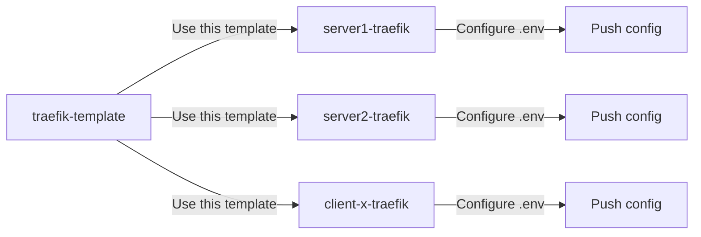

# 📋 GitHub Template Repository Setup Guide

## Prerequisites
- GitHub account
- Git installed locally
- GitHub Personal Access Token (PAT) - see instructions below
- This repository code ready

---

## 🔐 Phase 0: Setup GitHub Authentication

### Using Personal Access Token (Recommended for HTTPS)

If you already have a token, skip to "Configure Git to Use Token" below.

#### Create a Personal Access Token (if needed):
1. Go to GitHub → Settings → Developer settings → [Personal access tokens → Tokens (classic)](https://github.com/settings/tokens)
2. Click **"Generate new token (classic)"**
3. Name it (e.g., "Git Operations")
4. Select scope: **`repo`** (full control of private repositories)
5. Optional: Set expiration (90 days, 1 year, or no expiration)
6. Click **"Generate token"**
7. **COPY THE TOKEN IMMEDIATELY** (you won't see it again!)

#### Configure Git to Use Token:

**Option A: Store token in URL (Simple but visible in .git/config)**
```bash
# When adding remote, include token
git remote add origin https://YOUR_TOKEN@github.com/YOUR_USERNAME/traefik-template.git
```

**Option B: Use Git Credential Manager (More secure)**
```bash
# Configure credential helper to cache token
git config --global credential.helper cache

# Or store permanently (less secure)
git config --global credential.helper store

# Add remote without token
git remote add origin https://github.com/YOUR_USERNAME/traefik-template.git

# On first push, enter:
# Username: YOUR_USERNAME
# Password: YOUR_TOKEN (not your GitHub password!)
```

**Option C: Environment Variable (For scripts)**
```bash
# Set token as environment variable
export GITHUB_TOKEN=YOUR_TOKEN

# Use in git commands
git remote add origin https://${GITHUB_TOKEN}@github.com/YOUR_USERNAME/traefik-template.git
```

### Alternative: Using SSH Key

If you prefer SSH over HTTPS with token:

```bash
# Check for existing SSH key
ls -la ~/.ssh/id_*.pub

# Generate new key if needed
ssh-keygen -t ed25519 -C "your_email@example.com"

# Add to SSH agent
eval "$(ssh-agent -s)"
ssh-add ~/.ssh/id_ed25519

# Copy public key
cat ~/.ssh/id_ed25519.pub

# Add to GitHub: Settings → SSH and GPG keys → New SSH key
# Then use SSH URL for remote:
git remote add origin git@github.com:YOUR_USERNAME/traefik-template.git
```

---

## 🚀 Phase 1: Prepare Local Repository

### Step 1: Clean and Verify Structure
```bash
# Ensure you're in the repository
cd /home/docker/traefik

# Verify clean structure (no runtime files)
ls -la
# Should NOT contain: .env, data/, *.log, acme.json

# Check .gitignore is properly configured
cat .gitignore
# Should ignore: .env, data/, *.log, etc.
```

### Step 2: Initialize Git (if not already)
```bash
git init
git add .
git commit -m "Initial template commit"
```

---

## 🌐 Phase 2: Create GitHub Repository

### Step 3: Create New Repository on GitHub

1. Go to https://github.com/new
2. Fill in:
   - **Repository name**: `traefik-template`
   - **Description**: "Production-ready Traefik v3.5 template with automated setup, network segmentation, and security best practices"
   - **Public** (so others can use it) or **Private** (only for you)
   - ❌ **DON'T** initialize with README (we have one)
   - ❌ **DON'T** add .gitignore (we have one)
   - ❌ **DON'T** add license (we have one)
3. Click **Create repository**

### Step 4: Push Local Repository to GitHub

Choose based on your authentication method from Phase 0:

**If using Personal Access Token (HTTPS):**
```bash
# Option A: Token in URL
git remote add origin https://YOUR_TOKEN@github.com/YOUR_USERNAME/traefik-template.git

# Option B: Token via credential helper
git remote add origin https://github.com/YOUR_USERNAME/traefik-template.git
# Will prompt for username and token on push

# Option C: Token from environment variable
git remote add origin https://${GITHUB_TOKEN}@github.com/YOUR_USERNAME/traefik-template.git

# Push to GitHub
git branch -M main
git push -u origin main
# If using Option B, enter USERNAME and TOKEN when prompted
```

**If using SSH Key:**
```bash
# Add remote with SSH URL
git remote add origin git@github.com:YOUR_USERNAME/traefik-template.git

# Push to GitHub
git branch -M main
git push -u origin main
```

---

## ⚙️ Phase 3: Configure as Template

### Step 5: Enable Template Repository

1. Go to your repository on GitHub: `https://github.com/YOUR_USERNAME/traefik-template`
2. Click **Settings** (top menu)
3. In **General** section (should be default)
4. Scroll down to **Template repository** section
5. ✅ Check **Template repository**
6. Save changes (automatic)

### Step 6: Verify Template Status

- Go back to main repository page
- You should see green button **"Use this template"** instead of "Fork"
- The repository should show "Public template" or "Private template" badge

---

## 📝 Phase 4: Add Template Documentation

### Step 7: Create Template Usage Instructions

Create `TEMPLATE_USAGE.md` in root:

```markdown
# Using This Template

## Quick Start

1. Click **"Use this template"** button above
2. Name your new repository (e.g., `server1-traefik`)
3. Choose **Private** for production servers
4. Clone your new repository
5. Configure and deploy

## After Creating Your Repository

\```bash
# Clone YOUR new repository (not the template!)
# Using SSH:
git clone git@github.com:YOUR_USERNAME/YOUR-NEW-REPO.git

# OR using HTTPS with token:
git clone https://YOUR_TOKEN@github.com/YOUR_USERNAME/YOUR-NEW-REPO.git

cd YOUR-NEW-REPO

# Configure for your server
cp .env.example .env
nano .env  # Add your actual values

# For server repositories, update .gitignore to save .env
sed -i '/^\.env$/d' .gitignore  # Removes .env from gitignore

# Commit your configuration
git add .env .gitignore
git commit -m "Configure for production server"
git push

# Deploy
./scripts/setup.sh
docker-compose up -d
\```

## Updating from Template

To pull updates from the original template:

\```bash
git remote add template https://github.com/TEMPLATE_OWNER/traefik-template.git
git fetch template
git merge template/main --allow-unrelated-histories
# Resolve conflicts if needed, keeping your .env intact
\```
```

### Step 8: Update Main README

Add section at the top of README.md:

```markdown
> 📋 **This is a Template Repository!**
> Click the green **"Use this template"** button to create your own copy for your server.
> See [TEMPLATE_USAGE.md](TEMPLATE_USAGE.md) for detailed instructions.
```

---

## 🎯 Phase 5: Test Template

### Step 9: Test Template Creation

1. Click **"Use this template"** on your repository
2. Create a test repository called `test-server-traefik`
3. Clone and verify all files are present
4. Delete test repository when confirmed working

---

## 📊 Phase 6: Usage Workflow

### For Each New Server Deployment:



### Repository Organization:

```
GitHub Account/
├── traefik-template/        # Public/Private Template
│   ├── No .env              # Only .env.example
│   ├── No data/             # Created during setup
│   └── Clean structure      # Ready to use
│
├── server1-traefik/         # Private Repository
│   ├── .env                 # Real configuration (committed)
│   ├── Custom middlewares   # Server-specific
│   └── Full backup          # Everything saved
│
└── server2-traefik/         # Private Repository
    ├── .env                 # Different configuration
    ├── Custom services      # Server-specific
    └── Full backup          # Everything saved
```

---

## ✅ Phase 7: Best Practices

### For Template Repository:
- ✅ Keep it generic - no server-specific configs
- ✅ Use `.env.example` with clear placeholders
- ✅ Document everything
- ✅ Test scripts work on clean install
- ✅ Version your template (tags/releases)

### For Server Repositories (created from template):
- ✅ Always **Private** repositories
- ✅ Remove `.env` from `.gitignore`
- ✅ Commit your actual `.env` file
- ✅ Use meaningful commit messages
- ✅ Tag stable configurations

### Maintenance:
```bash
# In template repository
git tag -a v1.0.0 -m "Initial stable template"
git push --tags

# In server repositories - update from template
git fetch template
git diff template/v1.0.0 HEAD -- docker-compose.yml
git checkout template/v1.0.0 -- scripts/
```

---

## 🚨 Security Considerations

### Template Repository (Public):
- ❌ NEVER commit real credentials
- ❌ NEVER commit real domains
- ❌ NEVER commit certificates
- ✅ Only examples and placeholders

### Server Repositories (Private):
- ✅ CAN commit .env (if private)
- ✅ CAN commit certificates (if private)
- ⚠️ ENSURE repository is PRIVATE
- ⚠️ Use GitHub Secrets for extra sensitive data

---

## 📈 Success Metrics

Your template is successful when:
- ✅ New server deployment takes < 10 minutes
- ✅ All servers can be restored from their repos
- ✅ Updates can be pulled from template easily
- ✅ Each server has complete backup in GitHub
- ✅ No manual configuration needed beyond .env

---

## 🆘 Troubleshooting

### "Template repository" option not visible:
- Ensure you're repository owner
- Check repository isn't a fork
- Try different browser/clear cache

### Files missing after "Use this template":
- Check files are committed to main branch
- Verify no .gitignore issues
- Check GitHub Actions didn't filter files

### Can't push .env to server repository:
- Ensure `.env` removed from `.gitignore`
- Check file isn't in global gitignore
- Use `git add .env --force` if needed

### Authentication errors when pushing:
- **"Support for password authentication was removed"**: Use Personal Access Token, not GitHub password
- **"Invalid username or password"**: Token might be expired or lack `repo` scope
- **"Repository not found"**: Check token has access to private repos (needs `repo` scope)
- Regenerate token if needed: GitHub → Settings → Developer settings → Personal access tokens

### Token security tips:
- Use different tokens for different machines/purposes
- Set expiration dates for better security
- Revoke unused tokens regularly
- Never commit tokens to repositories
- Use environment variables in CI/CD pipelines