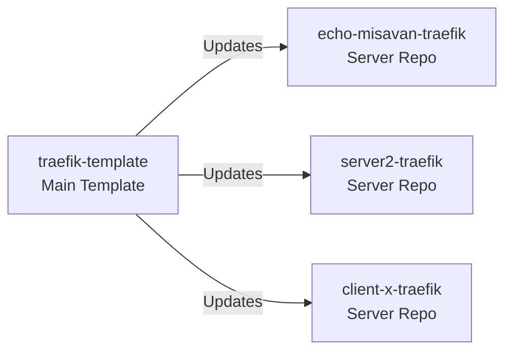

# 🔄 Updating Server Repositories from Template

This guide explains how to keep your server-specific repositories (like `echo-misavan-traefik`) updated with improvements from the main template repository (`traefik-template`).

## Overview



When `traefik-template` gets improvements (bug fixes, new features, security updates), you can pull these changes into your server repositories while keeping your specific configurations.

## Initial Setup (One Time Only)

### 1. Add Template as Remote Source

Run this **once** in each server repository:

```bash
# Navigate to your server repository
cd /opt/traefik  # or wherever your server repo is located

# Add the template as a remote source called "template"
git remote add template https://github.com/reluparfene/traefik-template.git

# Verify remotes are configured correctly
git remote -v
```

Expected output:
```
origin    https://github.com/reluparfene/echo-misavan-traefik.git (fetch)
origin    https://github.com/reluparfene/echo-misavan-traefik.git (push)
template  https://github.com/reluparfene/traefik-template.git (fetch)
template  https://github.com/reluparfene/traefik-template.git (push)
```

## Regular Update Process

### Method 1: Full Merge (Recommended)

This method brings all template updates while preserving your configurations:

```bash
# 1. Navigate to your server repository
cd /opt/traefik

# 2. Fetch latest changes from template
git fetch template

# 3. Review what changed (optional but recommended)
git log HEAD..template/main --oneline
git diff HEAD template/main --stat

# 4. Merge template updates
git merge template/main --allow-unrelated-histories -m "Update from template"

# 5. Resolve conflicts if any (keep YOUR .env and specific configs!)
# If conflicts occur, edit the files, then:
git add .
git commit -m "Resolved conflicts after template update"

# 6. Push to your server repository
git push origin main
```

### Method 2: Selective Updates

Update only specific files or directories:

```bash
# Fetch latest template changes
git fetch template

# Update only scripts
git checkout template/main -- scripts/
git commit -m "Update scripts from template"

# Update only documentation
git checkout template/main -- docs/ README.md
git commit -m "Update documentation from template"

# Update docker-compose.yml
git checkout template/main -- docker-compose.yml
git commit -m "Update docker-compose from template"

# Push selected updates
git push origin main
```

### Method 3: Cherry-Pick Specific Commits

For surgical precision - take only specific commits:

```bash
# Fetch and view template commits
git fetch template
git log template/main --oneline -10

# Pick a specific commit
git cherry-pick COMMIT_HASH

# Push the change
git push origin main
```

## Automated Update Script

Create `/opt/traefik/scripts/update-from-template.sh`:

```bash
#!/bin/bash

set -e

# Colors
GREEN='\033[0;32m'
YELLOW='\033[1;33m'
RED='\033[0;31m'
NC='\033[0m'

echo "================================================"
echo "   Updating from Template Repository"
echo "================================================"

# Save current configuration
echo -e "${YELLOW}Backing up configuration...${NC}"
cp .env .env.backup 2>/dev/null || true
cp -r data/configurations data/configurations.backup 2>/dev/null || true

# Fetch latest from template
echo -e "${YELLOW}Fetching latest template...${NC}"
git fetch template

# Show what's new
echo -e "${YELLOW}New updates available:${NC}"
git log HEAD..template/main --oneline || echo "No new updates"

# Ask for confirmation
read -p "Continue with update? (y/n) " -n 1 -r
echo
if [[ ! $REPLY =~ ^[Yy]$ ]]; then
    echo "Update cancelled"
    exit 1
fi

# Perform merge
echo -e "${YELLOW}Merging updates...${NC}"
if git merge template/main --allow-unrelated-histories -m "Update from template"; then
    echo -e "${GREEN}✅ Updates merged successfully${NC}"
else
    echo -e "${RED}⚠️  Conflicts detected! Please resolve manually${NC}"
    echo "Your configs are backed up as .env.backup"
    exit 1
fi

# Show changes
echo -e "${GREEN}Updated files:${NC}"
git diff HEAD~1 --stat

echo -e "${GREEN}✅ Update complete!${NC}"
echo "Review changes and push when ready: git push origin main"
```

Make it executable:
```bash
chmod +x /opt/traefik/scripts/update-from-template.sh
```

## What Gets Updated vs What Stays

### ✅ Safe to Update (from template)
- `scripts/` - Setup and utility scripts
- `docs/` - Documentation
- `config/*.template` - Configuration templates
- `examples/` - Service examples
- `docker-compose.yml` - Main Traefik service (review changes)
- `.gitignore` - Git ignore rules
- `README.md` - General documentation

### ⚠️ Review Carefully
- `docker-compose.yml` - Check for breaking changes
- `config/dynamic/` - Middleware configurations

### ❌ Never Update (keep your versions)
- `.env` - Your server-specific configuration
- `data/` - Runtime data and certificates
- `data/acme.json` - SSL certificates
- `data/configurations/` - Your custom dynamic configs
- Any custom services you've added

## Handling Conflicts

When conflicts occur during merge:

```bash
# 1. Check which files have conflicts
git status

# 2. Edit conflicted files
# Look for conflict markers: <<<<<<< HEAD
nano conflicted-file.yml

# 3. For .env conflicts, always keep YOUR version
git checkout --ours .env

# 4. For scripts, usually take template version
git checkout --theirs scripts/setup.sh

# 5. Mark as resolved
git add .

# 6. Complete the merge
git commit -m "Resolved conflicts - kept local configurations"

# 7. Push changes
git push origin main
```

## Update Schedule Recommendations

- **Weekly**: Check for updates, especially security fixes
- **Before major changes**: Update to get latest features
- **After template announcements**: When new features are announced

```bash
# Quick check for updates
cd /opt/traefik
git fetch template
git log HEAD..template/main --oneline

# If updates exist, run:
./scripts/update-from-template.sh
```

## Rollback if Needed

If an update causes issues:

```bash
# View recent commits
git log --oneline -10

# Revert to previous state
git reset --hard HEAD~1

# Or revert to specific commit
git reset --hard COMMIT_HASH

# Force push (careful!)
git push --force origin main

# Restore configuration backup
cp .env.backup .env
```

## Example Workflow

Real example updating `echo-misavan-traefik`:

```bash
# Monday: Template was updated with network fixes
cd /opt/traefik

# Check current status
git status  # ensure clean working directory

# Get updates
git fetch template
git log HEAD..template/main --oneline
# Shows: "Fix Docker network creation issues"

# Apply update
git merge template/main -m "Update from template: network fixes"

# Test locally
docker-compose config  # validate configuration
./scripts/create-networks-simple.sh  # test the fix

# If all good, push
git push origin main

# echo-misavan-traefik now has the fixes!
```

## Troubleshooting

### "Remote template not found"
```bash
# Add the remote
git remote add template https://github.com/reluparfene/traefik-template.git
```

### "Unrelated histories" error
```bash
# Use the flag
git merge template/main --allow-unrelated-histories
```

### Lost configuration after update
```bash
# Restore from backup
cp .env.backup .env
# Or from git history
git checkout HEAD~1 -- .env
```

### Want to see what changed
```bash
# Before merging
git fetch template
git diff HEAD template/main

# After merging
git diff HEAD~1
```

## Best Practices

1. **Always backup .env before updating**
2. **Test updates on staging first**
3. **Read template changelog/commits before updating**
4. **Keep server repos private**
5. **Document your custom changes**
6. **Use meaningful commit messages**

## Support

- Template Issues: Report at [traefik-template/issues](https://github.com/reluparfene/traefik-template/issues)
- Update Problems: Check this guide first
- Custom Configurations: Keep them documented in your server repo